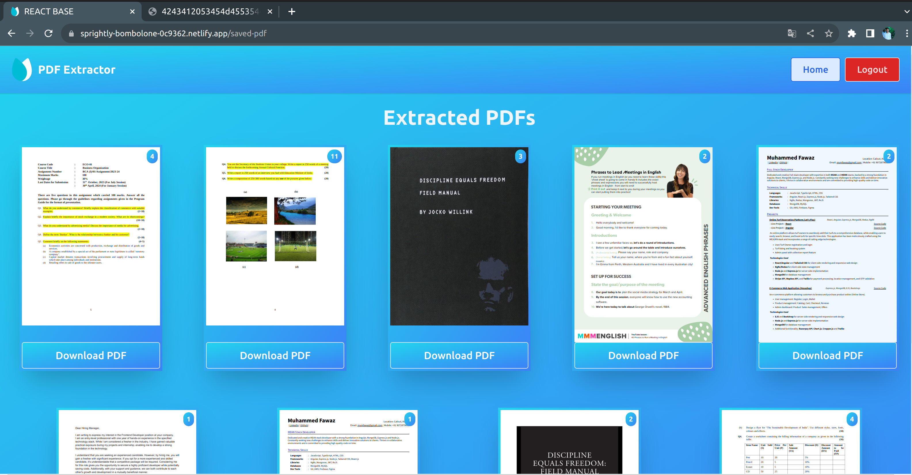

# PDF Page Extractor

This repository contains both the server-side and client-side code for a web application that allows users to upload PDF files and extract specific pages to create new PDFs. The server-side is built with Express.js, and the client-side is built with React.js. With this application, users can select the pages they want to include in the new PDF, offering a simple yet powerful PDF manipulation tool.

- Client-Side Hosted Link: [Client-Side Hosted Link](https://sprightly-bombolone-0c9362.netlify.app/)

- Server Hosted Link: [PDF Extractor Server](https://pdf-extractor-server.onrender.com)

## Server-Side

### Description

The server-side of the application is built with Express.js and provides the backend functionality for handling PDF file uploads and page extraction. It also serves as the API for the client-side application.

- Documentation: [API Documentation](https://documenter.getpostman.com/view/25497428/2s9YXb95kB)

### Installation

To run the server locally, follow these steps:

1. Clone the repository to your local machine.
2. Navigate to the `server` directory and install the required dependencies using `npm install`.
3. Create a `.env` file in the `server` directory and add the following environment variables:
   - `PORT`
   - `DATABASE_URL`
   - `JWT_SECRET_KEY`
   - `SERVER_URL`
4. Start the server using `npm start` or `npm run dev`.
5. Access the server through your web browser at the specified `PORT` or `http://localhost:8000`.

## Client-Side

### Description

The client-side of the application is built with React.js and provides a user-friendly interface for users to interact with the server-side, upload PDF files, and select specific pages for extraction.

### Installation

To run the client-side application locally, follow these steps:

1. Clone the repository to your local machine.
2. Navigate to the `client` directory and install the required dependencies using `npm install` or `npm i`.
3. Create a `.env` file in the `client` directory and add the following environment variable:
   - `VITE_API_URL` - specifying the server-side URL.
4. Start the client-side application using `npm run dev`.
5. Access the web application through your web browser at `http://localhost:5173`.

### Features

- **PDF File Upload**: Users can upload their PDF files to the server.
- **Page Extraction**: Select specific pages from the uploaded PDF to create a new PDF.
- **User-Friendly Interface**: A clean and intuitive user interface for easy navigation.
- **Customization**: Ability to customize the extracted PDF's page selection.

## Application Images

Here are some images from the application to give you a glimpse of its interface:

_Homepage: On the home page, you can select a PDF file._

_PdfSelected: In this view, you can see the selected PDF in its entirety and select the pages you want to extract for a new PDF._

_SavedPDFs: This section allows authenticated users to view the PDFs they've exported earlier._

_AuthModal: This modal is for managing authentication._

_Successfully Exported: By clicking the Download button, you can successfully export and download the PDF._

_MobileView: The application is designed to work seamlessly on mobile devices._

### Usage

1. Visit the client-side application in your browser.
2. Upload a PDF file.
3. Select the specific pages you want to extract and include in the new PDF.
4. Click the "Extract" or "Create PDF" button.
5. Download the newly generated PDF.

### Environment Variables

If you don't add the `.env` file, the application will automatically use default values for some settings to reduce errors and ensure a smoother initial experience. Here are the key environment variables that you can customize in the `.env` file:

- `PORT`: The default port is 8000, but you can change it if needed.
- `DATABASE_URL`: If not specified, the application will try to access a local database.
- `VITE_API_URL`: If not specified, the application will try to access http://localhost:8000.

It's recommended to add these environment variables to the `.env` file when configuring the application to suit your specific needs.

## Author

- Muhammed Fawaz

